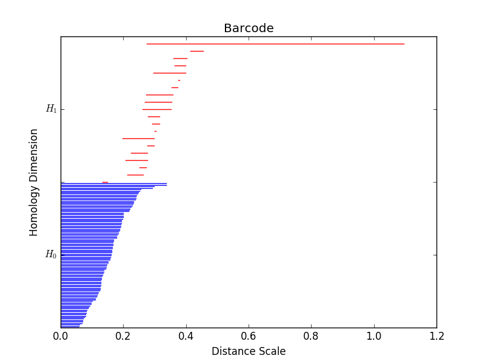

# Topology and Data Analysis with Dionysus

This repository contains applications of Topological Data Analysis (TDA),
interfacing with [Dionysus](http://www.mrzv.org/software/dionysus/).
You are encouraged to read the detailed and more technical account of
[TDA on Wikipedia](https://en.wikipedia.org/wiki/Topological_data_analysis).

The goal is to eventually create networks of data topology for a few realistic
datasets.

## Results

## Introduction

**Topology** main points, extremely informally:
* Topology is about classes of surfaces continuously deformable into each other.
* Surface is infinitely stretchy and compressible, but no ripping of the surface allowed.

**Topological Data Analysis** main points, also extremely informally:
* Topological data is a discretization of ideas from topology.
* TDA provides access to invariants (and more) under deformation.
* "Data has shape, and shape has meaning."
* TDA provides some understanding of high-dimensional (>3) space.

**Dionysus**:
* Calculate topological features from data.
* Package written in C++ with Python bindings.
* Can access many functions and attributes.
* Freely available, open sourced.
* Used in [R TDA](https://cran.r-project.org/web/packages/TDA/index.html).

For continuous space, famously, "the coffee cup is topologically equivalent to
a donut", which can be viewed
[on Wikipedia](https://upload.wikimedia.org/wikipedia/commons/2/26/Mug_and_Torus_morph.gif).  It's a bit different for a discrete space.
In data analysis, we often rescale features and then run the data through
a model.  Topological invariants are
insensitive to such transformations.  **Think of rescaling features as a
deformation**.

Capturing the concepts of topology for discrete sets of data is
accomplished through something called *persistent homology*.  Essentially it
means that we only connect points a certain distance (scale) apart.  As we
change the scale, for each scale we check to see which features are there.  So
for example, at some large enough scale, we will connect points across a hole
and the hole will disappear. Features that stick around *persist*. This is best
demonstrated through an example.  Consider noisy data in the shape of a circle:

As we change the length scale, we can see holes being 'born' and eventually
'dying'.  This results in a *birth-death* diagram, or equivalently, a
*barcode*.  Barcodes can be thought of as a fingerprint for the shape of the
data.  For example,

## Installation

Please see the [installation doc](docs/Installation.md).

## Requirements

* Dionysus
* NetworkX
* Matplotlib
* Numpy
